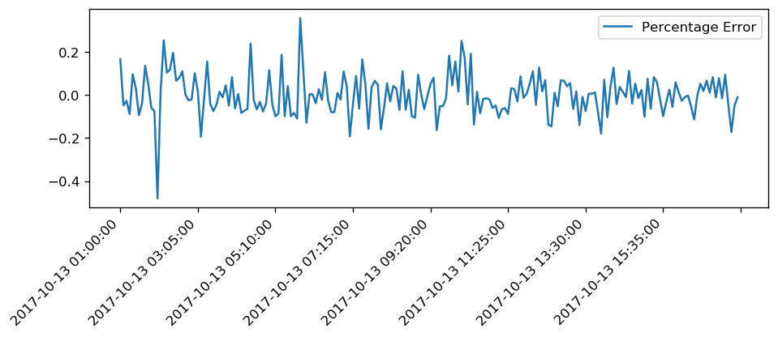

[](https://www.codefactor.io/repository/github/sumit-ai/time-series-arima-model)

# Time-series-ARIMA-model: 
An ARIMA model is a class of statistical models for analyzing and forecasting time series data.
It explicitly caters to a suite of standard structures in time series data, and as such provides a simple yet powerful method for making skillful time series forecasts.

## Libraries: 
```
import os
import pandas as pd
import numpy as np
from matplotlib import pyplot
from statsmodels.tsa.stattools import adfuller
from statsmodels.graphics.tsaplots import plot_acf, plot_pacf

```
## Features and Code Link 
- This repository contains python code for ime Series Forcasting using ARIMA. 
- This repository also explains the determination of p, d and q. 
- This code can be found **[here](https://github.com/Sumit-ai/Time-series-ARIMA-model/blob/master/Time%20series%20using%20ARIMA%20model%20.ipynb)** 



