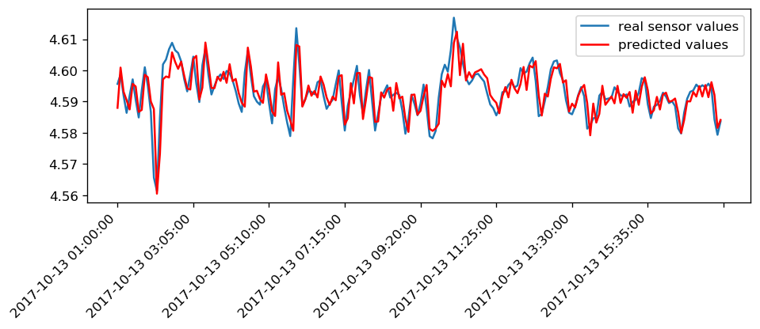

# Time-series-ARIMA-model: 
An ARIMA model is a class of statistical models for analyzing and forecasting time series data.
It explicitly caters to a suite of standard structures in time series data, and as such provides a simple yet powerful method for making skillful time series forecasts.

This repository contains python code for ime Series Forcasting using ARIMA. This repository also explains the determination of p, d and q. This code can be found **[here](https://github.com/Sumit-ai/Time-series-ARIMA-model)** 

