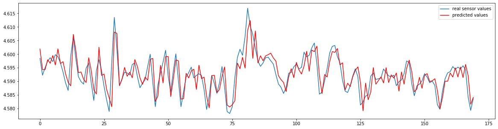

# Time-series-ARIMA-model: 

This repository contains python code for ime Series Forcasting using ARIMA. This repository also explains the determination of p, d and q. This code can be found **[here](https://github.com/Sumit-ai/Time-series-ARIMA-model)** 

